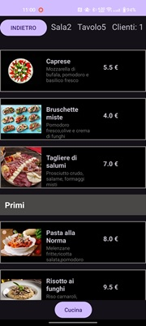
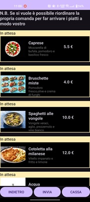
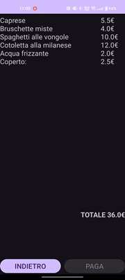

# **Menu**

### Explanation and introduction
This is an app that simulates a restaurant menu, letting you choose the table, the dining room, and the number of people, using a dropdown list and a box to enter how many guests per cover. On the second screen, there's a menu with descriptions, images, and prices, all divided into categories for appetizers, first courses, main courses, and drinks. Finally, there's a kitchen activity where you can drag dishes up and down according to the order they arrive and to the right to delete them, and with a label on each order sent that if the kitchen hasn't marked it as ready yet, it shows as pending with an orange/yellow background, otherwise as ready with a green background, this with polling and the onEdit hooked to the script that I linked, which gives the app the status of its orders, filtering every 20 seconds, with a send button to send them to the kitchen and see the total, which can only be paid once everything has arrived, with the option to get a PDF with everything to use at the register or a Google Sheet page.

### Inspiration
I did this project with Android Studio, a software I discovered while studying computer science at school. I wanted to do this project because I want to improve my computer skills by learning more about Java, and how did I come up with this? this project came to mind, improving a lot on the one I made for school with App Inventor

### Download instructions: 
Go to the itch address https://vittori02-ui.itch.io/menu and download the APK. Download it to an android phone and follow the Play Store procedures for downloading external apps which would be a check of the external apps and then you can use the app

### Useful links related to the project
These are respectively the link to the Google Sheet and to the JavaScript code that manages the connection between the app and the spreadsheet
https://docs.google.com/spreadsheets/d/1j8t-t4bCTDechkKuC70biME7DtDhzCcQAFuAJPpdk6A/edit?gid=0#gid=0
https://script.google.com/d/1e4txFrX4Yq5J9f86ZtZ8Uih-RRCGE-R412W7qrEz9OyMABgQOv4Ezkuz/edit?usp=sharing

### Some photos

